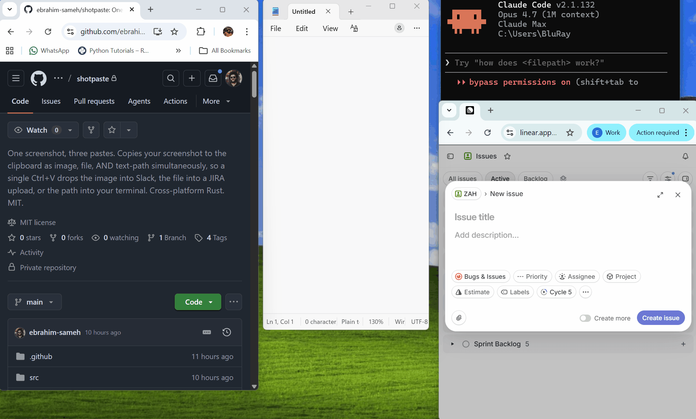

# shotpaste

> **One screenshot, three pastes.**



[](https://github.com/ebrahim-sameh/shotpaste/actions/workflows/ci.yml)
[](https://crates.io/crates/shotpaste)
[](https://crates.io/crates/shotpaste)
[](https://github.com/ebrahim-sameh/shotpaste/releases)
[](./LICENSE)


shotpaste is a tiny background daemon that watches your screenshot folder. When a new screenshot lands, it copies it to the clipboard as **image bytes**, **a file-drop list**, *and* **the file path as text** — all at once, in a single clipboard write. Then **one paste** does the right thing in any app:

```
   Press PrtScn  →  shotpaste sees the new PNG  →  writes the clipboard once with:

      ├──── image bytes ────►  Slack, WhatsApp, Discord, image editors, browsers
      ├──── file-drop list ─►  JIRA upload, file pickers, file managers
      └──── text path ──────►  terminals, editors, markdown previews
```

No more screenshotting twice. No more drag-from-Explorer. No more "wait, which paste does this app want?"

---

## Install

```sh
# macOS / Linux
curl -fsSL https://github.com/ebrahim-sameh/shotpaste/releases/latest/download/shotpaste-installer.sh | sh
shotpaste install
```

```powershell
# Windows
irm https://github.com/ebrahim-sameh/shotpaste/releases/latest/download/shotpaste-installer.ps1 | iex
shotpaste install
```

The first line drops a single static `shotpaste` binary on disk (`~/.cargo/bin` on Linux/macOS, `%CARGO_HOME%\bin` or `~\.cargo\bin` on Windows). The second registers it to start at login.

> **Want to inspect the install script first?** `curl -fsSL <url-from-above>` prints it. The releases page also publishes the sha256 of every artifact.

Already have a Rust toolchain? You can also install from crates.io (builds from source — slower than the prebuilt installer above):

```sh
cargo install shotpaste
shotpaste install
```

## Quickstart

1. Press your normal screenshot shortcut (Win+PrtScn, Cmd+Shift+3, PrtScn).
2. Paste anywhere with `Ctrl+V` / `Cmd+V`.
3. That's it.

Verify with `shotpaste status`. The default watched folder is your OS's standard screenshot directory; pass a different path to `shotpaste watch` to override.

## Why not just use ShareX / Greenshot / Snipping Tool?

Existing screenshot tools either give you the **image** on the clipboard or the **file path**, never both — and almost none of them are cross-platform. shotpaste is a single static binary that does all three formats simultaneously on Windows, macOS, and Linux.

| Tool | Image paste | File-drop paste | Path-text paste | All three in one paste | AI coding tools | Cross-platform | FOSS | Price |
|---|:-:|:-:|:-:|:-:|:-:|:-:|:-:|---|
| **shotpaste**           | ✓ | ✓ | ✓ | **✓** | **✓** | Win + macOS + Linux | ✓ MIT | Free |
| ShareX                  | ✓ | ✓ | ✓ | ✗ | ✗ | Windows only | ✓ MIT | Free |
| Greenshot / Flameshot   | ✓ | ✗ | ✗ | ✗ | ✗ | varies | ✓ | Free |
| Lightshot               | ✓ | ✗ | ✗ | ✗ | ✗ | Win + macOS | ✗ | Free |
| CopyCut / winclipshot   | ✗ | ✗ | ✓ | ✗ | ✗ | Windows only | ✓ | Free |
| Snagit                  | ✓ | ✗ | ✗ | ✗ | ✗ | Win + macOS | ✗ | Paid |
| Snipping Tool / macOS Screenshot | ✓ | ✗ | ✗ | ✗ | ✗ | native | bundled | Free |

ShareX has separate "Copy image" and "Copy file path" after-capture actions, but doing both formats from a single capture has been a [long-standing open feature request](https://github.com/ShareX/ShareX/issues/7651). shotpaste does it by default.

**Coming from [`Higangssh/winclipshot`](https://github.com/Higangssh/winclipshot)?** shotpaste does the same path-on-clipboard trick — but puts it *alongside* the image and file-drop formats instead of replacing them. You keep the path-paste superpower in your terminal without losing image-paste in Slack/WhatsApp/Discord. And it works on macOS and Linux, not just Windows.

## Use cases

**Bug report to your team.** A 500 error appears. You screenshot the stack-trace overlay. In your team's Slack thread: `Cmd+V` → image attached, everyone sees it. Click into the JIRA ticket's "Drop files here" zone, `Cmd+V` again → same screenshot uploads as a real `.png` file attachment, not a paste-as-image. Two pastes, zero file-manager round-trips.

**UI bug from QA → GitHub PR.** QA screenshots a misaligned modal. Slack: `Cmd+V` → image inline for the squad. GitHub PR description: `Cmd+V` → path pasted, ready to wrap as ``. Same clipboard, both contexts.

**Notion + a markdown changelog.** You're writing release notes in Notion and a CHANGELOG.md at the same time. Same screenshot. Notion: `Cmd+V` renders inline. VS Code on the markdown file: `Cmd+V` pastes the absolute path. The image is right there in both surfaces, no alt-tabbing.

**WhatsApp Web + a remote terminal.** Screenshot a failing CI log. WhatsApp Web in the browser: `Ctrl+V` → image attached to the team chat. SSH session in the next tab: `vim "$(Get-Clipboard)"` (PowerShell) or `vim "$(xclip -o)"` (Linux) opens the very same screenshot — because the path text is also on the clipboard.

**Screenshot → Claude Code / Cursor.** A weird CSS bug appears in your browser. Screenshot it. In Claude Code or Cursor's chat panel: `Cmd+V` → image attaches and the agent *sees* the bug. Need it to read the source file too? Same paste in the agent's terminal or a `@file` reference — the absolute path is on the clipboard, so the agent can `Read` the file and grep nearby code. One screenshot, both halves of the loop.

## How it works

1. A small background daemon watches your screenshot folder using each OS's native filesystem-event API (`ReadDirectoryChangesW` on Windows, `FSEvents` on macOS, `inotify` on Linux).
2. When a new `.png` lands, the daemon decodes it and builds a single multi-format clipboard write.
3. The OS's native multi-format clipboard API gets all three formats in one transaction — `IDataObject` on Windows, `NSPasteboard.writeObjects:` on macOS, atomic `wl_data_source` (Wayland) or X11 selection ownership (X11) on Linux.

About 1 MB of compiled Rust per platform, statically linked, zero runtime dependencies you have to install yourself.

## Configuration

Default watched folder per platform (override by passing `shotpaste watch <path>`):

- **Windows**: `%USERPROFILE%\Pictures\Screenshots` (Win+PrtScn default)
- **macOS**: `~/Desktop` (Cmd+Shift+3 / 4 / 5 default — to relocate, run `defaults write com.apple.screencapture location ~/Pictures/Screenshots && killall SystemUIServer`)
- **Linux**: `${XDG_PICTURES_DIR:-$HOME/Pictures}/Screenshots` (the GNOME / KDE Spectacle default)

Logs:
- Windows: `%LOCALAPPDATA%\shotpaste\shotpaste.log` (when present), otherwise stderr if run from a console.
- macOS: `~/Library/Logs/shotpaste.log`
- Linux: `journalctl --user -u shotpaste`

Set `SHOTPASTE_LOG=debug` in the environment for verbose tracing.

## Privacy

shotpaste is a local-only tool. **No network calls, no telemetry, no uploads.** The only network connection is when you run the install script — to download the release archive from GitHub Releases.

## Uninstall

```sh
# macOS / Linux
shotpaste uninstall          # removes autostart entry
shotpaste uninstall --purge  # also removes config dir
rm ~/.cargo/bin/shotpaste    # removes the binary
```

```powershell
# Windows
shotpaste uninstall          # removes Scheduled Task
shotpaste uninstall --purge  # also removes config dir
Remove-Item ~\.cargo\bin\shotpaste.exe
```

## Roadmap

Considering for future releases (no commitments):

- Custom watch folders (multiple dirs, OneDrive, Dropbox)
- Per-format toggles (disable file-drop on systems where it conflicts)
- Optional auto-upload format (imgur / 0x0.st URL alongside image+file+path, opt-in only)
- Filename templates (`{app}_{yyyy-MM-dd}_{HHmmss}.png`)
- OCR text format — paste OCR'd text into editors instead of the path
- Windows ARM64 build (currently deferred — cargo-dist 0.31 cross-compile container has an apt-get prompt issue)

## Contributing

Issues and PRs welcome. The code is small (~700 lines of Rust). Before opening a PR:

```sh
cargo build
cargo test
cargo clippy --all-targets -- -D warnings
cargo fmt --all -- --check
```

CI runs the same on Ubuntu, Windows, and macOS.

## License

MIT — see [LICENSE](./LICENSE).

## Acknowledgements

- Inspired by [`Higangssh/winclipshot`](https://github.com/Higangssh/winclipshot), which solves the path-paste half of this problem on Windows.
- Built on excellent crates: [`clipboard-win`](https://github.com/DoumanAsh/clipboard-win), [`clipboard-rs`](https://github.com/ChurchTao/clipboard-rs), [`notify`](https://github.com/notify-rs/notify), [`notify-debouncer-full`](https://github.com/notify-rs/notify), [`image`](https://github.com/image-rs/image), [`clap`](https://github.com/clap-rs/clap).
- Release pipeline: [`cargo-dist`](https://github.com/axodotdev/cargo-dist).
